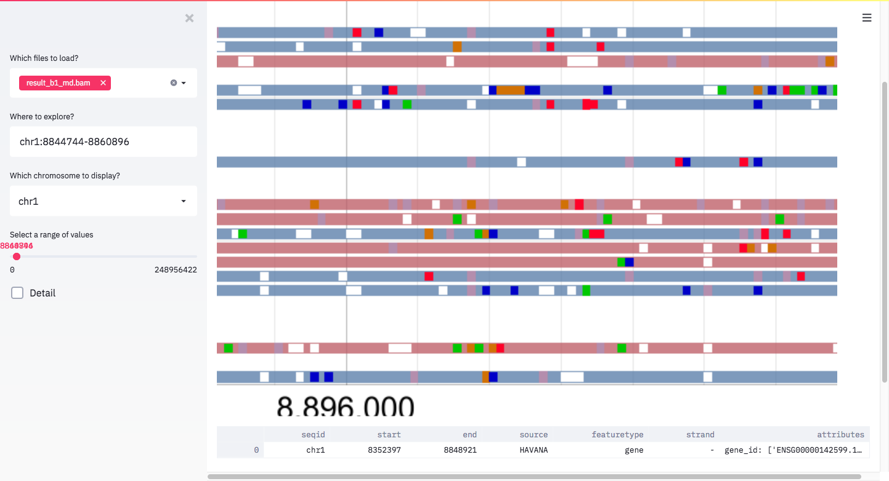
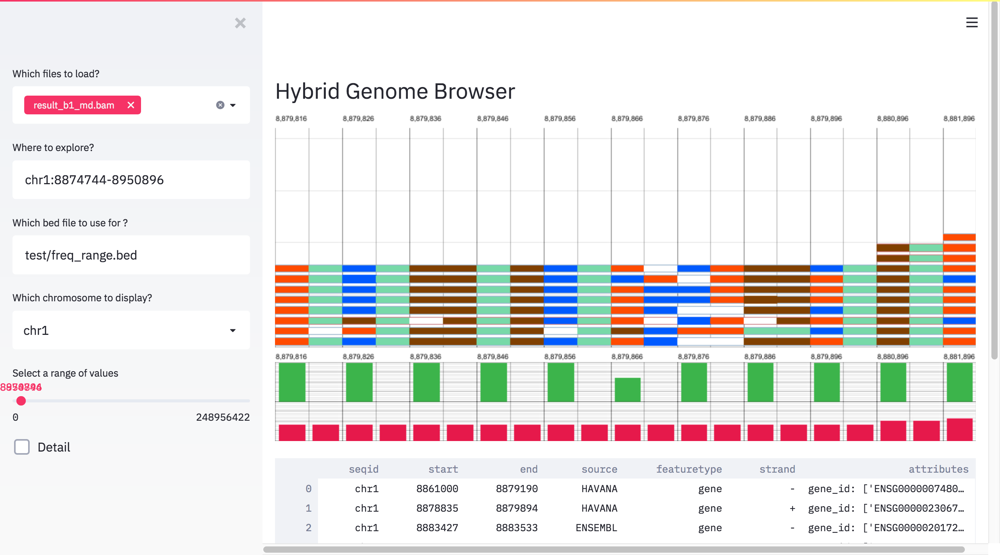

# Streamlit-HGB

A streamlit component example of a hybrid genome browser



## Features

* Customizable browser appearance
* Zooming in/out read alignments
* Query region by gene name based on gff/gtf database
* Gene annotation table for specified region

## Getting started

* hgb

[hgb](https://github.com/6br/hgb) is prerequired.

```bash
git clone https://github.com/6br/hgb
cd hgb
git checkout graph
cargo build --release
```

* virtualenv

```bash
git clone https://github.com/6br/hgb_demo
cd hgb_demo
python3 -m venv venv  # create venv
. venv/bin/activate   # activate venv
pip install streamlit_hgb pandas gffutils argh streamlit-drawable-canvas # install streamlit and dependencies
```

And then put BAM and BAI files on that folder to visualize.

```bash
export STREAMLIT_HOST=$(hostname -i)
export HGB_BIN=/*location_to_hgb_binary*/

streamlit run hgb.py 
```

hgb binary is usually located at `/dir/to/cloned/hgb/target/release/hgb`. 
Specify HGB_BIN, otherwise set the path to hgb as `export PATH=$PATH:/dir/to/hgb/`.

## Getting started on `hgb_draw`



`hgb_draw` mode supports the discontinuous x-axis mode for SNP imputation or CpG island methylation. 

```bash
$ python3 -m venv venv  # create venv
$ . venv/bin/activate   # activate venv
$ pip install streamlit_hgb pandas gffutils argh streamlit-drawable-canvas # install streamlit and dependencies
```

```bash
export STREAMLIT_HOST=$(hostname -i)
export HGB_BIN=/*location_to_hgb_binary*/

streamlit run hgb_draw.py 
```

An example of BED file is as follows.

```bed
chr1	8879816	8879818	*	78
chr1	8879826	8879828	*	75
chr1	8879836	8879838	*	46
chr1	8879846	8879848	*	87
chr1	8879856	8879858	*	99
chr1	8879866	8879868	*	12
chr1	8879876	8879878	*	56
chr1	8879886	8879888	*	43
``` 

## Generate GFF database

The default gene database is generated from [GENCODE Human release v34 basic annotation](https://www.gencodegenes.org/human/).
If you want to change the database, you can generate database from your own gff/gtf file.

```bash
$ pip install gffutils
$ ./gffutils-cli create --disable-infer-genes input.gtf
```

## Example of `config.yaml`

There is two ways to modify the input file of the browser.

1. Directly modify `hgb.py`
2. Write `config.yaml` at the same directory of `hgb.py`

```yaml
hg38:
  range: 
    - chr1:1-1000001
  default:
    - "/path/to/bamfile1.bam"
  alignments: 
    - "/path/to/bamfile1.bam"
    - "/path/to/bamfile2.bam"
  db:
    - "/path/to/gff.db"
```

* Range: a default range to visualize
* Default: a default set of BAM file to be loaded
* Alignments: a list of BAM file
* DB: a gff database generated by gffutils

All input bam files must be indexed by `samtools index` or compatibles.


